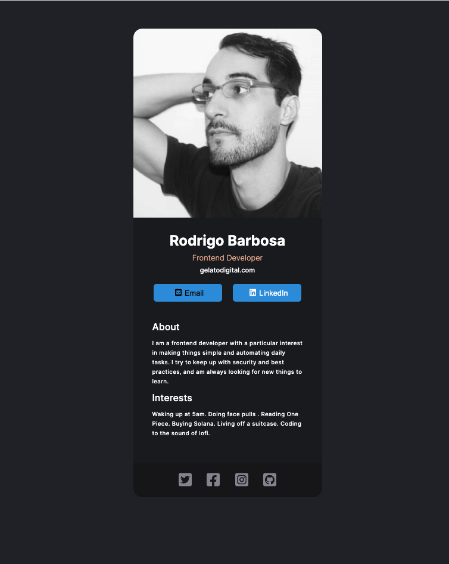

# Scrimba Frontend Career Path - (Virtual Business Card - Module 11)

This is a solution to the [Scrimba Frontend Career Path - (Module 11-React/Virtual Business Card)](https://scrimba.com/learn/frontend).

## Table of contents

- [Overview](#overview)
  - [The challenge](#the-challenge)
  - [Screenshot](#screenshot)
  - [Links](#links)
- [My process](#my-process)
  - [Built with](#built-with)
  - [What I learned](#what-i-learned)
  - [Continued development](#continued-development)
  - [Useful resources](#useful-resources)
- [Author](#author)
- [Acknowledgments](#acknowledgments)


## Overview

### The challenge

Without any tutorial (no video solution to follow along) I should be able to follow the figma files and create a fully functional React app on my machine, that works as a virtual business card.

After this Challenge I should be able to Code/Understand:

- React set up
- Linking CSS on React, Googel fonts on React and FontAwesome Icons on React
- npm run build
- Netlify react Deployment
- Work with Figma

### Screenshot



### Links

- Solution Github URL: [https://github.com/Rod-Barbosa/rodrigo-virtual-card](https://github.com/Rod-Barbosa/rodrigo-virtual-card)
- Live Site URL: [https://rodrigo-virtual-card.netlify.app/](https://rodrigo-virtual-card.netlify.app/)
## My process

### Built with

- React
- Semantic HTML5 markup
- CSS custom properties
- JavaScript

### What I learned

Importing fontawesome Icons, one needs to pay attention to solid or brand category:

``` React
import { FontAwesomeIcon } from '@fortawesome/react-fontawesome'
import { faEnvelopeSquare } from '@fortawesome/free-solid-svg-icons'
import { faFacebookSquare, faTwitterSquare, faInstagramSquare, faGithubSquare } from '@fortawesome/free-brands-svg-icons'
```

To style them, all you need is to add className and thigns work normally
down on the code it looks like this:
```React
            <FontAwesomeIcon icon={faEnvelopeSquare}/>
            <br/>
            <FontAwesomeIcon icon={faFacebookSquare}/>
```

Google fonts in tact go on the css like this:

```css
<style>
@import url('https://fonts.googleapis.com/css2?family=Inter:wght@300;500;700&display=swap');
</style>
```

For cropping images with CSS, set the parent container to a fixed height smaller than the image child, and overflow hidden takes care of the rest:

```css
header {
    height: 317px;
    overflow: hidden;

}
.avatar-img {
    border-top-right-radius: 15px;
    border-top-left-radius: 15px;
    width: 100%;
    height: 320px;
}
```


### Continued development

This could go 1000 different directions, but just adding stuff to the screen seems counter productive to a tab extension that is supposed to free your mind from being bombarded by too much information

### Useful resources

- [font awesome in React](https://stackoverflow.com/questions/56559772/where-do-i-find-the-object-names-of-icons-in-the-fontawesome-free-packages) - The naming convention is obvious once you know it, but impossible until someone shows it to you
- [lil trick for cropping images](https://themetry.com/css-image-cropping/) - Not having to go outside of CSS is such a relief

## Author

- Website - [Rodrigo Portfolio](https://www.gelatodigital.com)
- Frontend Mentor - [@Rod-Barbosa](https://www.frontendmentor.io/profile/Rod-Barbosa)
- Github - [@Rod-Barbosa](https://github.com/Rod-Barbosa)

## Acknowledgments

I would like to thank my father who just celebrated his 38th year of marriage with my mom. They showed me a virtual business card from a friend of them and it was the motivation behind taking this exercise seriously
